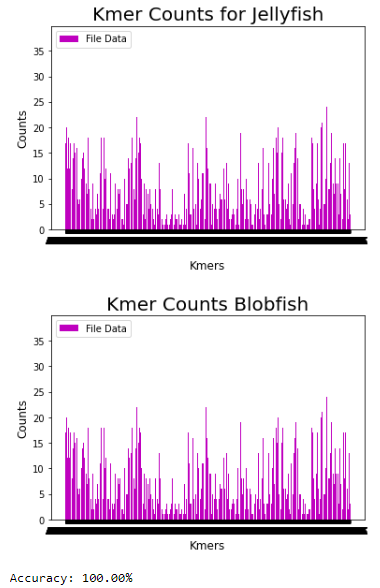

Benchmarking
-----------------
__Runtime__

To perform benchmarking analysis on runtime run both the jellyfish command and the blobfish command as specified in this repo's README file with the command time in front of it. For example:

    time jellyfish count -m 6 -C -s 10M -o jellyfish_output.txt example_genome.fa
      >
        real    0m0.015s
        user    0m0.009s
        sys     0m0.005s
        
    time python blobfish.py ount -l 6 -canonical -f example_genome.fa -o jellyfish_output.jf
      >
        real    0m0.415s
        user    0m0.409s
        sys     0m0.408s
        
__Accuracy__

This folder contains the code which we used to benchmark accuracy for blobfish under the file accuracy.py. We implemented benchmarking accuracy through analyzing differences between histograms as well as a script that compares each kmer and its kmer count in both jellyfish and blobfish output files and gives out a percent accuracy. Through both the histograms and comparison script we received results that show 100% accuracy when running with the required options as well as canonical option.

You can run the code we have to benchmark in Jupyter notebook or your local python ide, just make sure you are specifying the correct file path names for the jellyfish and blobfish output files.

1. To benchmark create output files in the .txt format for both your jellyfish and blobfish methods. To convert the outputted jellyfish file to a .txt file use the following command:
    
        jellyfish dump jellyfish_output.jf > jellyfish_output.txt

2. Run our accuracy.py script method in a Jupyter Notebook or a Python IDE. You can run this by copy and pasting into the same file at the end of the file outside the methods or in another cell on Jupyter Notebook
      
        file1 = "jellyfish_output.txt"
        file2 = "blobfish_output.txt"
        accuracy = compare_kmer_counts(file1, file2)
      >  
     

